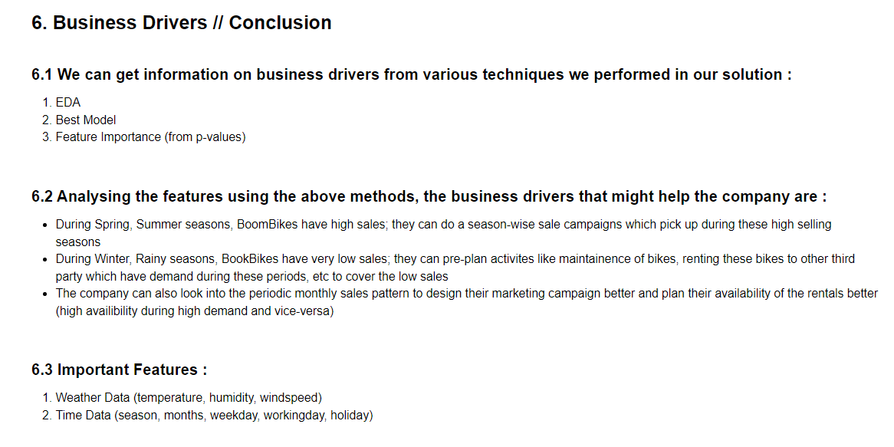

# Bike-Sharing-Demand-Prediction
> My solution to the Bike Sharing Demand Predition Programming Assignment

## Table of Contents
* [Problem Statement](#problem-statement)
* [Solution Content](#solution-content)
* [Technologies Used](#technologies-used)

<!-- You can include any other section that is pertinent to your problem -->

## Problem Statement

BoomBikes aspires to understand the demand for shared bikes among the people after this ongoing quarantine situation ends across the nation due to 
Covid-19. They have planned this to prepare themselves to cater to the people's needs once the situation gets better all around and stand out from other
service providers and make huge profits.

**GOAL** :
1. Understand which variables are significant in predicting the demand for shared bikes
2. Analyze how well those variables describe the bike demands

## Solution Content

Important solution content : 

1. [Modelling & Analysis Notebook](Bike-Sharing_Demand_Prediction.ipynb) : This notebook contains the full analysis & modelling parts done
          - NOTE : Please re-run the notebook if the plots in the notebook aren't visible (plolty plots sometimes doesn't show in git render)
3. [Subjective Question & Answers](Subjective-Question-Answers.pdf) : Answers of the questions provided in a pdf format

## Business Drivers - Conclusions

## Technologies Used
1. Plotly==5.9.0
2. Pandas==1.4.3
3. Numpy==1.21.5
4. scikit-learn==1.1.1
5. statsmodels==0.13.2

## Contact
Created by [@kranthik13] - feel free to contact us!
